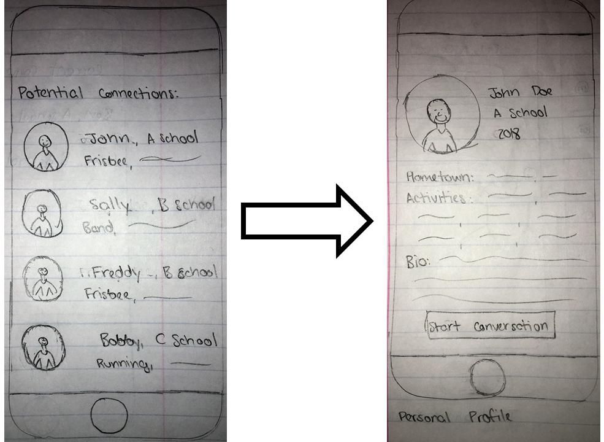
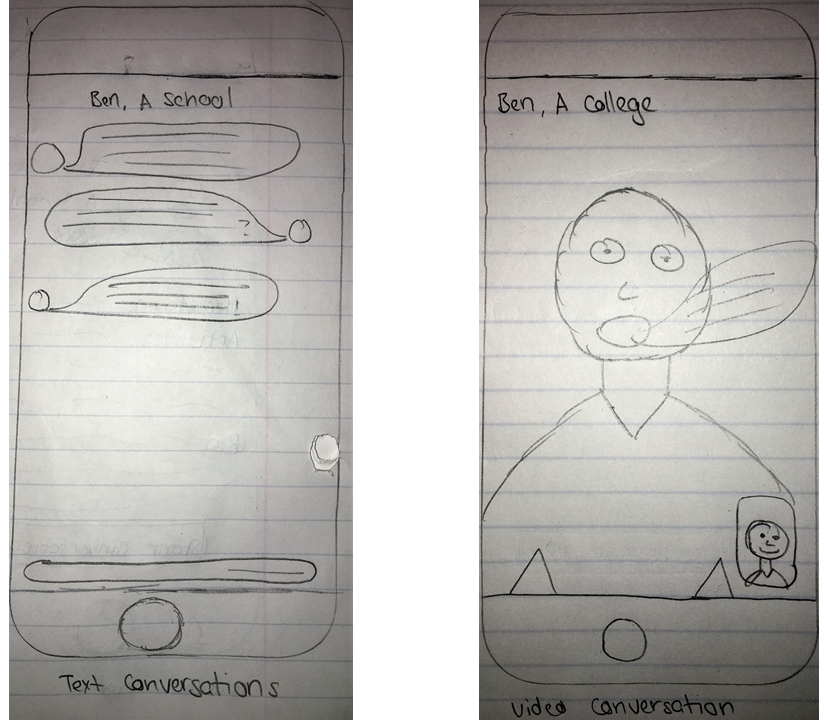
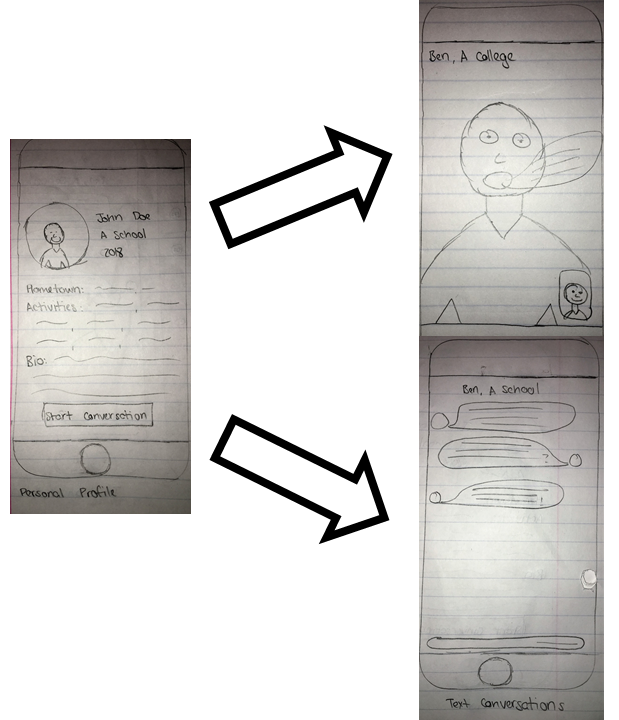
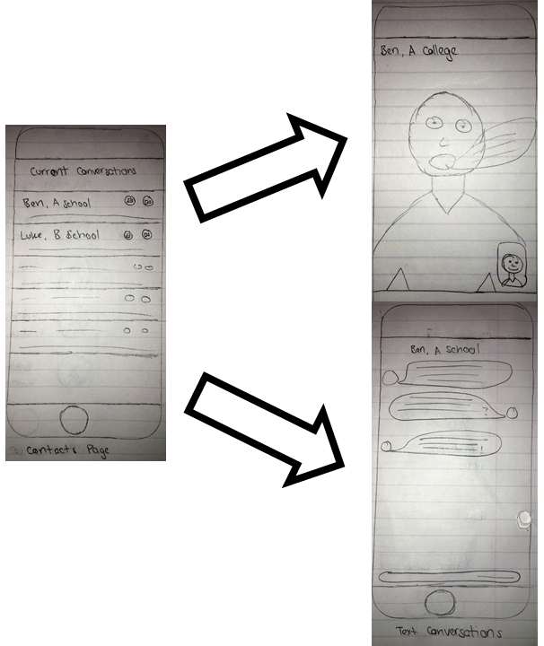

## Tasks

### 3) Sharing Basic Information with Other Users – Easy Task
Hopper is a shy high school student from LA looking for current college students to discuss college experiences in general.  She prefers communicating with freshman college girls.  Also, she hopes to find students attending school near LA so that they have the possibility of meeting up.  Because of her shyness, Hopper values privacy highly.  She does not want everyone in the world to see the information she shares.  She is comfortable sharing with others her personal information such as photos and hometown only after they have been introduced to each other.  She wants to be able to share basic information to help her get to know others easily.  She also wants control of the content she shares.

4) College Ranking – Hard Task
Turing is a high school student from California looking for colleges. He loves warm weather, enjoys climbing mountains and detests snow. He likes large cities. He is into computer science and is also looking into playing football in college. He knows that he has strong academics, so he has a general feeling of what tier of schools are good fits for him. However, as there are still too many schools to consider, Turing needs help with picking out a set of schools that will allow him to continue his interests in college. Within this set, Turing is interested in knowing which ones fit him the best, so that it is easier to make the right choices. Turing wants a ranked list of schools that take his interests into account.

## Design 1

Tasks:
1.  Share basic information with other users
2.  College forum
3.  Find others who have similar interests
4.  Speak candidly without fear of repercussion from colleges /  Final Verification

Main idea:
This design focuses on the perspective of users who are current college students.  This is a mobile app that allows users to create/edit personal information, participate in a forum about colleges, find other users with similar interests, and accept requests from other users.  For each task, the user can gain an overview with ease.  The user is also able to switch between tasks effortlessly.

Task Completion:
1.  Share basic information with other users.
*  Click on the "Me" button/tab on the bottom to go to the basic information page
*  Contains basic information such as name, school, and interests that the user can edit
*  User can choose to upload a profile picture

2. College forum
*  Click on the "Forum" button/tab on the bottom to go to the college forum page
*  Page consists of a search bar, a "post" action, and forum displays 
*  Can swipe up for more posts
*  Can click on the post stub to see more information or respond

3.  Find others who have similar interests
*  Click on the "Matches" button/tab on the bottom to go to the similar interests page
*  Displays simplified profiles of prospective students who the user might be interested in
*  Each profile displays profile picture, name, and the reason why the profile appears here - common interests.
*  Can click on the profile for more information or actions

4. Speak candidly without fear of repercussion from colleges / Final verification
*  Click on the "Requests" button/tab on the bottom to go to the requests page
*  Contains requests from prospective students
*  Each request appears in the form of a brief profile, along with a reason for the request or a short question
*  The user can choose to accept the request for private conversation, reply with answer to a short question or ask for more information, or deny the request. 

### Design 2: Connection-Centered Design

This design centers the interpersonal aspect of the College Connect platform.  The opening page contains a list of potential connections (for applicant users, a list of college students from their selected schools; for college users, a list of applicants interested in their school).  From this page, the user can navigate to the personal profile of each connection, and start conversations via text or video chat.  Users have full control of the information listed on their personal profile.

#### Task 1: Find other users with similar interests to you.

The list of potential connections on the opening page highlights overlapping interests.  From here, users can navigate to the personal profiles of their potential connections, see the other interests they have listed, and read a short bio that the user wrote about themself.  This will provide a comfortable and anonymous means by which users can look for other users with similar interests, and chose to connect with them if they are interested.

#### Task 2: Speak candidly without fear of repercussion from colleges

The text and video chat features of the platform will enable comfortable and candid conversation about user questions.  Because the platform itself is independent of colleges and all connections are formed between users directly, users will be able to have discussions without concern for what college administratiors or admissions officers might think.  Modeled after common interpersonal communication apps, this design will cultivate a relaxed environment for discussion.

#### Task 3: Sharing basic information with other users

The personal profile feature will allow users to share information, as they choose, with potential connections.  The basic information sections (school, hometown, activities) will provide necessary information for finding potential connections, and the open-ended bio section will allow users to provide whatever other information they believe would be useful or interesting.  Additionally, users can share additional information as they feel comfortable using the chat features.

#### Task 4: Final verification

By developing connections on the platform throughout the college search and decision process, applicant users will be able to discuss their final concerns with current students.  These students can act as a resource throughout the process, and provide genuine, experience-based feedback on their time at the college and any questions that an applicant may have.

