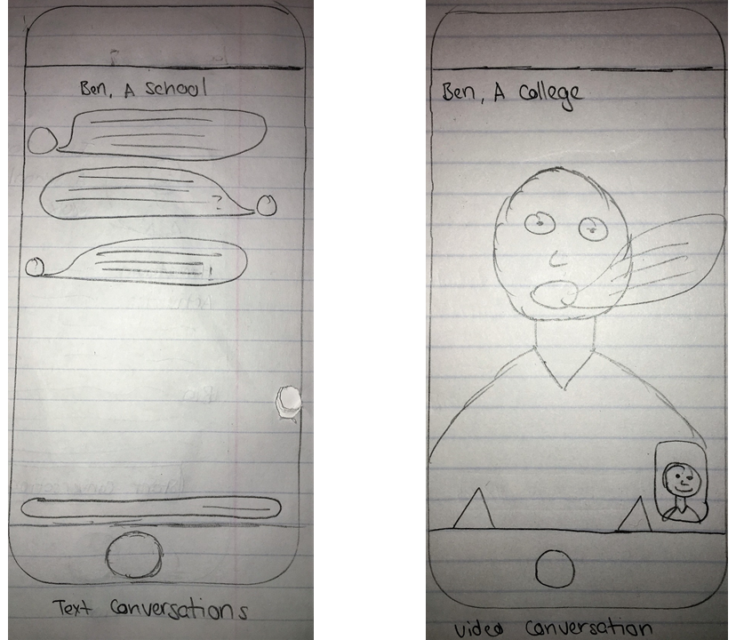
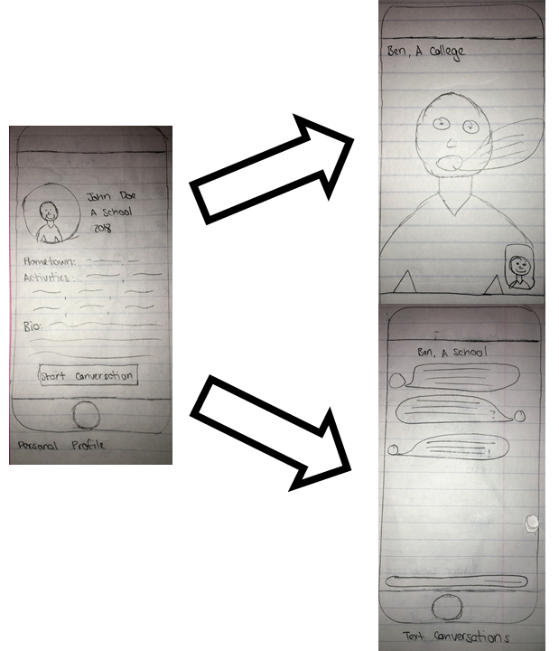
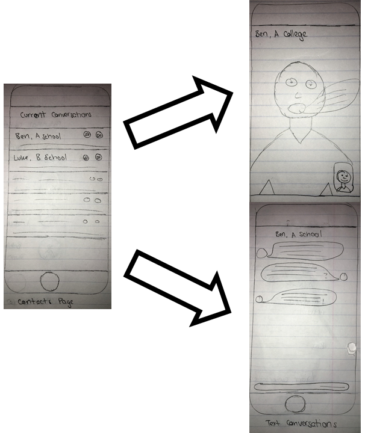

## Tasks

### 1) Find other who have similar interests to you - Medium Task
Sally, a current high school senior, logs on to College Connect to learn more about the schools that she is applying to.  She lives on the west coast, but is interested in attending Williams College.  Because of the distance, she will not be able to visit Williams, and does not know any current students at the college.  However, after sharing her personal information and passion for playing the oboe on the platform, she is able to see several Williams students who have overlapping interests and backgrounds.  Sally is able to connect with George, a Williams student who attended a nearby high school, and Gaby, who participates in the wind ensamble at Williams.  Through conversations with these students, Sally is able to learn more about the experience of students at Williams with whom she shares background and interests and get an honest representation of life at Williams.

### 2) Speak candidly without fear of repercussion from colleges - Easy Task
John is a current high school senior applying to Williams College.  He recently connected with Timmy, a current senior at Williams on College Connect.  While John is excited at the possibility of attending Williams, he was nervous about rumors that he had heard about the academic culture on campus, but does not feel comfortable bringing these concerns up with an admissions officer for fear of hurting his application status.  Because Timmy, as a student user of College Connect, is not affiliated with the admissions office, John is able to direct his questions to Timmy candidly.  Additionally, because Timmy does not have any obligation to encourage John to attend Williams, he is able and willing to provide honest, genuine answers about his own experience at the college.  Through this exchange, John gets honest responses to his questions from an experienced source.

### 3) Sharing Basic Information with Other Users – Easy Task
Hopper is a shy high school student from LA looking for current college students to discuss college experiences in general.  She prefers communicating with freshman college girls.  Also, she hopes to find students attending school near LA so that they have the possibility of meeting up.  Because of her shyness, Hopper values privacy highly.  She does not want everyone in the world to see the information she shares.  She is comfortable sharing with others her personal information such as photos and hometown only after they have been introduced to each other.  She wants to be able to share basic information to help her get to know others easily.  She also wants control of the content she shares.

### 4) College Ranking – Hard Task
Turing is a high school student from California looking for colleges.  He loves warm weather, enjoys climbing mountains and detests snow.  He likes large cities.  He is into computer science and is also looking into playing football in college.  He knows that he has strong academics, so he has a general feeling of what tier of schools are good fits for him.  However, as there are still too many schools to consider, Turing needs help with picking out a set of schools that will allow him to continue his interests in college.  Within this set, Turing is interested in knowing which ones fit him the best, so that it is easier to make the right choices.  Turing wants a ranked list of schools that take his interests into account.

### 5) College Forums - Easy Task
We want users to get a well-rounded view of what college students value on their campuses, and what experiences most accurately encompass those views.

Miles is a high school senior unsure of what colleges are out there and what students value on each campus. He would like a general overview of student experiences, both positive and negative, on different campuses, and how they impact students’ views of their school. Miles discovers the ‘School Forums’ section and reads about many colleges, including many posts from students currently attending the selected school. After reading many posts, Miles realizes that some schools are not for him given student perceptions, helping him rank his college list.

### 6) Final Verification - Medium Task
We would like users to be comfortable in their final college acceptance decision.

Tracy is a high school senior who's been accepted to her current top choice college. However, there are still questions lingering in the back of her mind, that if clarified, will be the final push for her to ultimately commit. Luckily, her college has a list of students who are willing to answer any questions prospective students may have. Tracy contacts Clara, a current student at Tracy's top college choice, who answers all of Tracy's questions. After their interactions, Tray is confident in her decision.

## Designs

### Connection-Centered Design

This design centers the interpersonal aspect of the College Connect platform.  The opening page contains a list of potential connections (for applicant users, a list of college students from their selected schools; for college users, a list of applicants interested in their school).  From this page, the user can navigate to the personal profile of each connection, and start conversations via text or video chat.  Users have full control of the information listed on their personal profile.

#### Task 1: Find other users with similar interests to you.

The list of potential connections on the opening page highlights overlapping interests.  From here, users can navigate to the personal profiles of their potential connections, see the other interests they have listed, and read a short bio that the user wrote about themself.  This will provide a comfortable and anonymous means by which users can look for other users with similar interests, and chose to connect with them if they are interested.

#### Task 2: Speak candidly without fear of repercussion from colleges

The text and video chat features of the platform will enable comfortable and candid conversation about user questions.  Because the platform itself is independent of colleges and all connections are formed between users directly, users will be able to have discussions without concern for what college administratiors or admissions officers might think.  Modeled after common interpersonal communication apps, this design will cultivate a relaxed environment for discussion.

#### Task 3: Sharing basic information with other users

The personal profile feature will allow users to share information, as they choose, with potential connections.  The basic information sections (school, hometown, activities) will provide necessary information for finding potential connections, and the open-ended bio section will allow users to provide whatever other information they believe would be useful or interesting.  Additionally, users can share additional information as they feel comfortable using the chat features.

#### Task 4: Final verification

By developing connections on the platform throughout the college search and decision process, applicant users will be able to discuss their final concerns with current students.  These students can act as a resource throughout the process, and provide genuine, experience-based feedback on their time at the college and any questions that an applicant may have.

